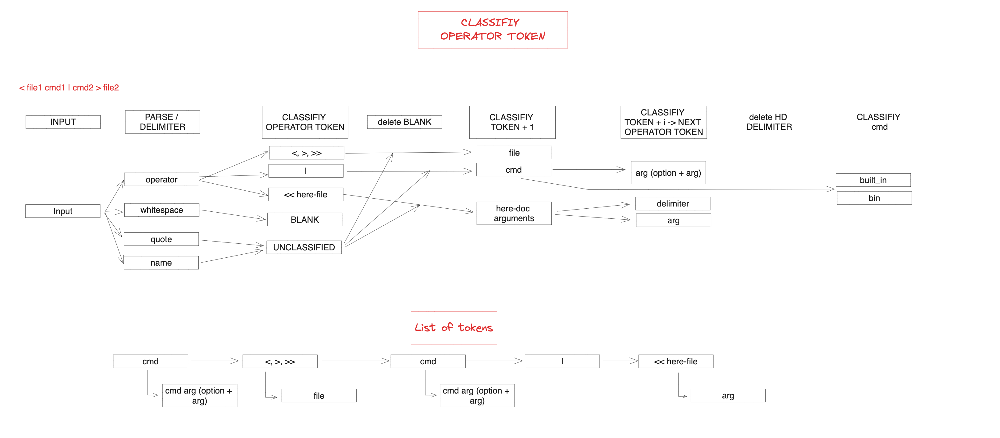

# Process for a standard shell

https://pubs.opengroup.org/onlinepubs/009695399/utilities/xcu_chap02.html

# Definitions (selection of)
Definitions:

## Angle Brackets
The characters '<' (left-angle-bracket) and '>' (right-angle-bracket). When used in the phrase "enclosed in angle brackets", the symbol '<' immediately precedes the object to be enclosed, and '>' immediately follows it. When describing these characters in the portable character set, the names <less-than-sign> and <greater-than-sign> are used.

## Braces
The characters '{' (left brace) and '}' (right brace), also known as curly braces. When used in the phrase "enclosed in (curly) braces" the symbol '{' immediately precedes the object to be enclosed, and '}' immediately follows it. When describing these characters in the portable character set, the names <left-brace> and <right-brace> are used.

## Brackets
The characters '[' (left-bracket) and ']' (right-bracket), also known as square brackets. When used in the phrase "enclosed in (square) brackets" the symbol '[' immediately precedes the object to be enclosed, and ']' immediately follows it. When describing these characters in the portable character set, the names <left-square-bracket> and <right-square-bracket> are used.

## Control Operator
In the shell command language, a token that performs a control function. It is one of the following symbols:

&   &&   (   )   ;   ;;   newline   |   ||

## Name
In the shell command language, a word consisting solely of underscores, digits, and alphabetics from the portable character set. The first character of a name is not a digit.

## Portable Filename Character Set
The set of characters from which portable filenames are constructed.

A B C D E F G H I J K L M N O P Q R S T U V W X Y Z
a b c d e f g h i j k l m n o p q r s t u v w x y z
0 1 2 3 4 5 6 7 8 9 . _ -

## Redirection Operator
In the shell command language, a token that performs a redirection function. It is one of the following symbols:

<     >     >|     <<     >>     <&     >&     <<-     <>

Special Parameter
In the shell command language, a parameter named by a single character from the following list:

*   @   #   ?   !   -   $   0

Token
In the shell command language, a sequence of characters that the shell considers as a single unit when reading input. A token is either an operator or a word.

## White Space
A sequence of one or more characters that belong to the space character class as defined via the LC_CTYPE category in the current locale.

In the POSIX locale, white space consists of one or more <blank>s ( <space>s and <tab>s), <newline>s, <carriage-return>s, <form-feed>s, and <vertical-tab>s.

## Word
In the shell command language, a token other than an operator.